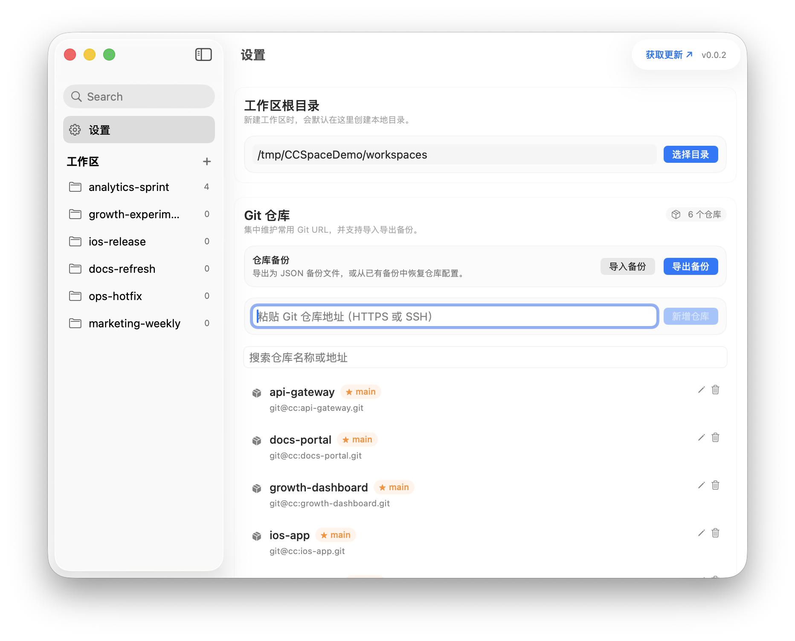
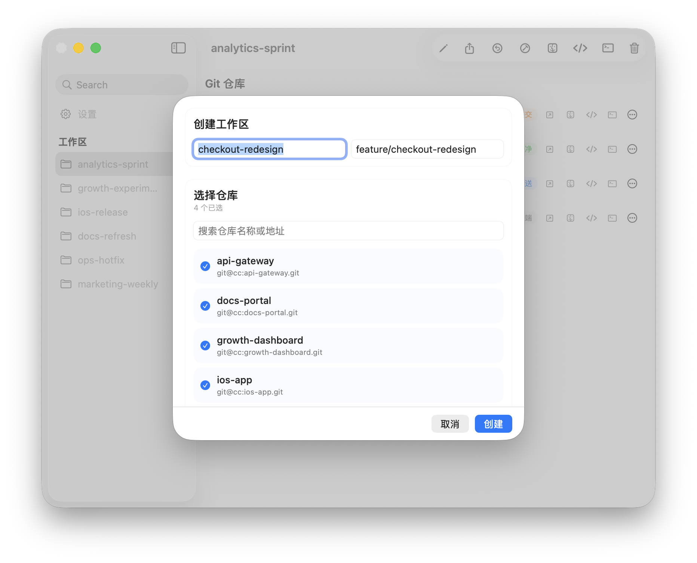
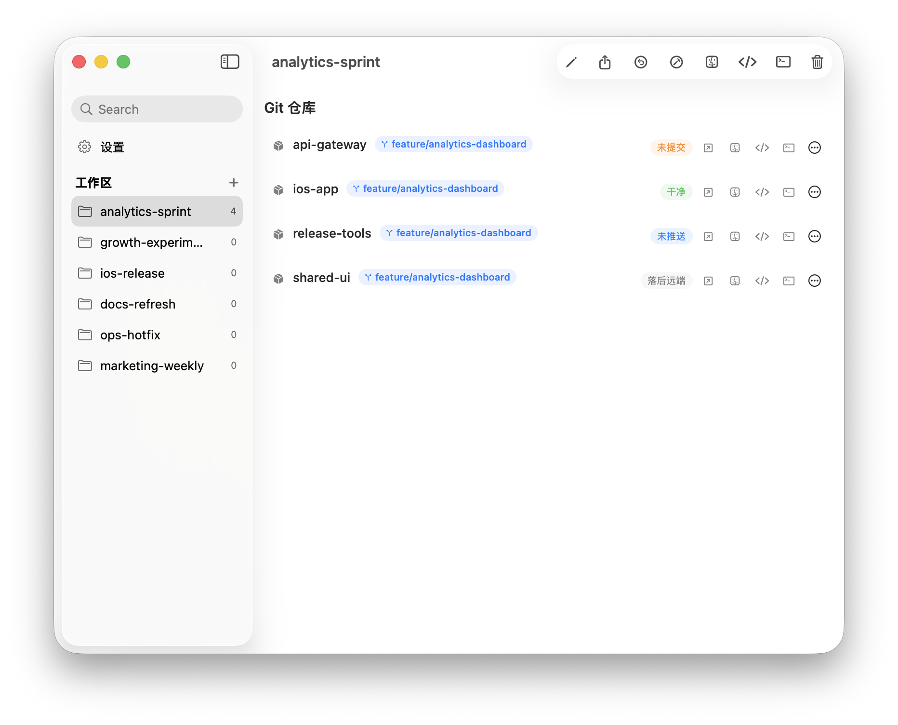

# CCSpace

macOS 多仓库工作区管理工具。配置常用 Git 仓库，按需组合创建工作区，并行克隆，统一管理分支与同步状态。

## 界面预览

以下为基于演示数据生成的真实软件截图，重点展示仓库库配置、工作区创建和工作区详情这三个核心使用场景。

### 1. 仓库库配置

集中维护常用 Git 仓库地址与工作区根目录，便于后续快速组合工作区。



### 2. 创建工作区

从仓库库中勾选目标仓库，填写工作区名称和工作分支，一键并行创建。



### 3. 工作区详情

统一查看仓库分支状态，批量执行同步、推送和分支切换操作。



## 功能介绍

### 仓库库配置

在设置页面管理常用的 Git 仓库：

- 粘贴 Git URL（HTTPS 或 SSH）即可添加，仓库名自动解析
- 支持删除仓库
- 自动校验重复的 URL 和仓库名

### 创建工作区

从仓库库中勾选需要的仓库，一键创建工作区：

- 输入工作区名称，可选设置工作分支
- 所有选中的仓库并行克隆到工作区目录
- 如果设置了工作分支，会优先使用远端同名分支；若不存在，则基于默认分支创建本地分支

### 工作区管理

每个工作区提供完整的批量操作和状态视图：

**批量操作：**

| 操作 | 说明 |
|------|------|
| 同步全部 | 拉取所有仓库的最新代码 |
| 推送全部 | 推送所有需要推送的当前分支提交 |
| 合并默认分支 | 将各仓库的默认分支合并到当前分支 |
| 切换默认分支 | 所有仓库切回各自的默认分支 |
| 切换工作分支 | 所有仓库切到工作区配置的工作分支 |
| 在 Finder 中打开 | 打开工作区目录 |
| 在终端中打开 | 在 Terminal.app 中打开工作区目录 |

**单仓库操作：**

- 点击分支标签切换本地分支
- 更多操作菜单支持拉取、推送、切换分支、合并默认分支、删除，以及打开 Finder/终端
- 克隆失败的仓库可一键重试

**仓库状态：**

| 状态 | 含义 |
|------|------|
| Clean | 工作区干净 |
| Uncommitted | 有未提交的更改 |
| Unpushed | 有未推送的提交 |
| Behind Remote | 落后于远程分支 |
| Not Cloned | 尚未克隆 |
| Error | 操作出错 |

### 编辑工作区

- 修改工作区名称（自动重命名本地目录）
- 修改工作分支（会切换已保留的本地仓库；已在目标分支的仓库会自动跳过）
- 添加或移除仓库（新仓库并行克隆，移除时如本地目录存在会一并删除本地文件）
- 所有操作支持事务回滚，失败时自动还原

### 自动刷新

- 当前激活工作区的 Git 状态每 15 秒刷新一次
- 每 30 秒自动扫描本地目录状态
- 已删除的工作区和仓库自动清理
- 分支状态实时更新

### 自动更新检查

启动时检查 GitHub Releases，有新版本时在设置页面提示更新。

## 系统要求

- macOS 14.0+
- Swift 6.0+
- Xcode 16+

## 开发

```bash
# 构建并运行
./run.sh

# 仅构建
./run.sh build

# 运行测试
./run.sh test

# 清理构建产物
./run.sh clean
```

### README 截图

以下命令会基于 `script/readme-screenshot-fixture/` 中的演示数据，在 `/tmp/CCSpaceDemo` 下重建截图所需的本地 Git 场景，并且只更新 `README.md` 当前实际引用的那 3 张图：

```bash
# 直接更新 README 当前引用的正式截图
./run.sh readme-screenshots

# 或直接调用脚本
./script/generate_readme_screenshots.sh
```

如果只想先验收产物、不覆盖仓库里的正式图片，可以改写到临时目录：

```bash
./script/generate_readme_screenshots.sh --output-root "$(mktemp -d)"
```

## 发布

创建并推送 release tag：

```bash
./release.sh patch   # v1.0.2 -> v1.0.3
./release.sh minor   # v1.0.2 -> v1.1.0
./release.sh major   # v1.0.2 -> v2.0.0
./release.sh 1.2.3   # 直接发布 v1.2.3
```

GitHub Actions 会自动构建 macOS universal binary，打包 DMG 并创建 GitHub Release。

## License

MIT
