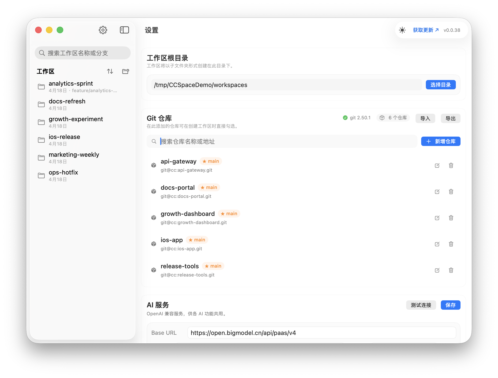
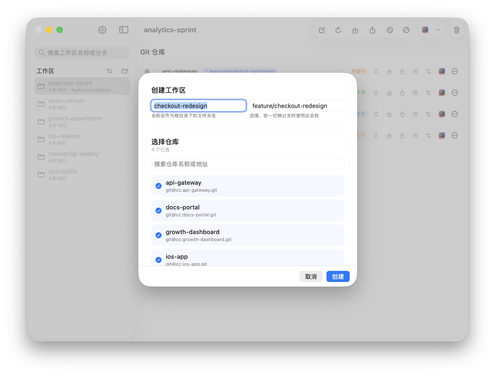
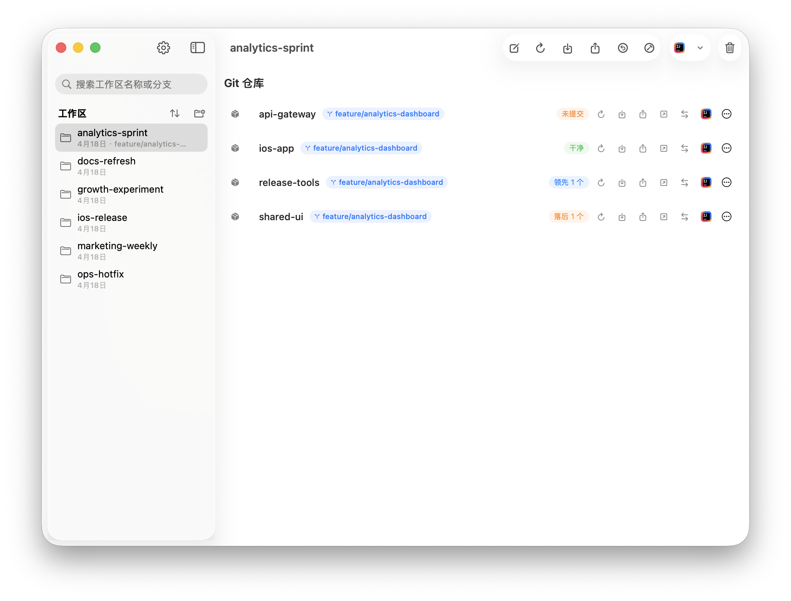

# CCSpace

macOS 多仓库工作区管理工具。配置常用 Git 仓库，按需组合创建工作区，并行克隆，统一管理分支与同步状态。

## 界面预览

以下为基于演示数据生成的真实软件截图，重点展示仓库库配置、工作区创建和工作区详情这三个核心使用场景。

### 1. 仓库库配置

集中维护常用 Git 仓库地址与工作区根目录，便于后续快速组合工作区。



### 2. 创建工作区

从仓库库中勾选目标仓库，填写工作区名称和工作分支，一键并行创建。



### 3. 工作区详情

统一查看仓库分支状态，批量执行同步、推送和分支切换操作。



## 功能介绍

### 仓库库配置

在设置页面管理常用的 Git 仓库：

- 粘贴 Git URL（HTTPS 或 SSH）即可添加，仓库名自动解析
- 支持删除仓库
- 自动校验重复的 URL 和仓库名

### 创建工作区

从仓库库中勾选需要的仓库，一键创建工作区：

- 输入工作区名称，可选设置工作分支
- 所有选中的仓库并行克隆到工作区目录
- 如果设置了工作分支，会优先使用远端同名分支；若不存在，则基于默认分支创建本地分支

### 工作区管理

每个工作区提供完整的批量操作和状态视图：

**批量操作：**

| 操作 | 说明 |
|------|------|
| 同步全部 | 拉取所有仓库的最新代码 |
| 推送全部 | 推送所有需要推送的当前分支提交 |
| 合并默认分支 | 将各仓库的默认分支合并到当前分支 |
| 切换默认分支 | 所有仓库切回各自的默认分支 |
| 切换工作分支 | 所有仓库切到工作区配置的工作分支 |
| 在 Finder 中打开 | 打开工作区目录 |
| 在终端中打开 | 在 Terminal.app、iTerm2 或 Warp 中打开工作区目录（按本机安装自动列出） |

**单仓库操作：**

- 点击分支标签打开分支面板：切换本地分支、切换远端分支（本地不存在时自动跟踪远端），或直接新建分支
- 更多操作菜单支持拉取、推送、切换分支、合并默认分支、Stash 改动、删除，以及打开 Finder/终端
- 克隆失败的仓库可一键重试
- 查看提交记录：独立窗口（可与主窗口并行操作），展示最近提交，含文件变更数与增删行数统计，点击可查看该提交的 Diff；支持按提交说明、作者或 commit ID 搜索，可切换"仅看未推送"，支持加载更多；顶部可切换任意本地分支查看其历史；点击提交行展开完整提交信息（正文/完整 ID/作者邮箱/时间）；提交右键菜单支持基于此提交创建并切换新分支、在浏览器打开提交页（GitHub/GitLab/Gitee）
- 分支比较：独立窗口，from/to 两侧分支均可切换（本地分支与远端跟踪分支，带搜索），支持一键互换方向；头部展示两侧独有提交数，下方复用 Diff 查看器展示文件级差异（折叠/双栏/展示所有行）
- 查看改动：查看工作区未提交改动的 Diff，按文件分组、增删行着色，支持逐文件丢弃改动（修改/删除恢复到上次提交，未跟踪文件直接删除，操作前有确认提示），并支持输入提交信息一键提交全部改动
- Stash 列表：查看Stash 栈（含切分支时自动 Stash的记录），逐条恢复或删除；切换分支/合并默认分支时如有未提交改动会自动 Stash并在操作后恢复
- 冲突处理：拉取/合并/变基产生冲突后，状态会显示"冲突 N 个"，点击打开冲突面板查看冲突文件列表，并可一键中止进行中的合并、变基、Cherry Pick、Revert 或二分操作（有二次确认）

**仓库状态：**

| 状态 | 含义 |
|------|------|
| Clean | 工作区干净 |
| Uncommitted | 有未提交的更改，点击查看改动 |
| 冲突 N 个 | 有 N 个文件存在合并冲突，点击查看冲突文件并中止操作 |
| 领先 N 个 | 有 N 个未推送的提交，点击直接推送 |
| 落后 N 个 | 落后远程分支 N 个提交，点击直接拉取 |
| Not Cloned | 尚未克隆 |
| Error | 操作出错 |

### AI 服务（可选）

在设置页「AI 服务」区块配置 OpenAI 兼容服务（Base URL、模型名与 API Key），供提交信息生成等 AI 功能共用：

- 模型名支持从服务一键拉取可用列表、下拉选择；「测试连接」可当场验证地址、Key 与模型
- 未提交改动窗口的提交栏提供 AI 按钮，一键根据当前改动生成提交信息，自动跟随仓库近期提交的语言与风格
- 生成结果填入输入框，可修改后再提交，也可以反复点击换一个结果
- 超大 diff 自动截断，优先省略 lockfile 等信息密度低的改动
- 生成时改动的 diff 内容会发送到你配置的服务地址，请知悉

### 系统通知

批量操作（同步、推送、切换分支等）完成或失败时发送 macOS 系统通知，无需停留在当前窗口即可获知结果。启动时请求通知权限。

### 编辑工作区

- 修改工作区名称（自动重命名本地目录）
- 修改工作分支（会切换已保留的本地仓库；已在目标分支的仓库会自动跳过）
- 添加或移除仓库（新仓库并行克隆，移除时如本地目录存在会一并删除本地文件）
- 所有操作支持事务回滚，失败时自动还原

### 自动刷新

- 当前激活工作区的 Git 状态每 5 秒刷新一次；窗口重新聚焦或应用切回前台时立即刷新
- 每 2 分钟自动扫描本地目录状态（同时重新检测外部编辑器与终端，新安装的应用无需重启即可出现在"打开方式"菜单）
- 已删除的工作区和仓库自动清理
- 分支状态实时更新

### 自动更新检查

启动时检查 GitHub Releases，有新版本时在设置页面提示更新。

## 系统要求

- macOS 14.0+
- Swift 6.0+
- Xcode 16+

## 开发

```bash
# 构建并运行
./run.sh

# 仅构建
./run.sh build

# 运行测试
./run.sh test

# 清理构建产物
./run.sh clean
```

### README 截图

以下命令会基于 `script/readme-screenshot-fixture/` 中的演示数据，在 `/tmp/CCSpaceDemo` 下重建截图所需的本地 Git 场景，并且只更新 `README.md` 当前实际引用的那 3 张图：

```bash
# 直接更新 README 当前引用的正式截图
./run.sh readme-screenshots

# 或直接调用脚本
./script/generate_readme_screenshots.sh
```

如果只想先验收产物、不覆盖仓库里的正式图片，可以改写到临时目录：

```bash
./script/generate_readme_screenshots.sh --output-root "$(mktemp -d)"
```

## 发布

创建并推送 release tag：

```bash
./release.sh patch   # v1.0.2 -> v1.0.3
./release.sh minor   # v1.0.2 -> v1.1.0
./release.sh major   # v1.0.2 -> v2.0.0
./release.sh 1.2.3   # 直接发布 v1.2.3
```

GitHub Actions 会自动构建 macOS universal binary，打包 DMG 并创建 GitHub Release。

## License

MIT
